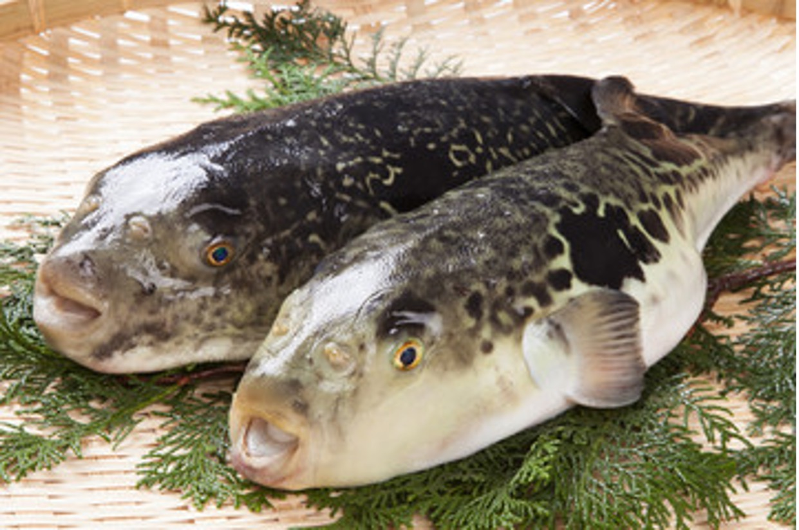
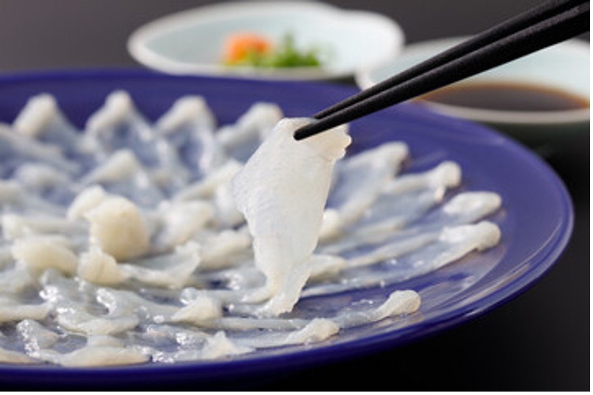
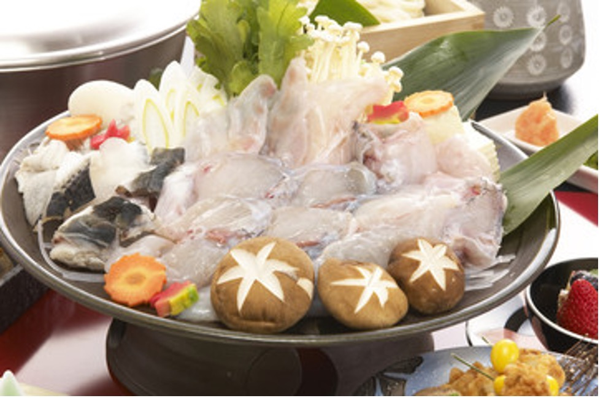
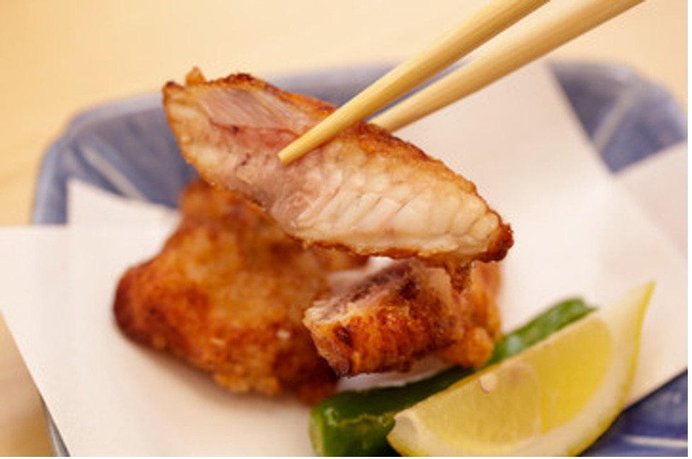
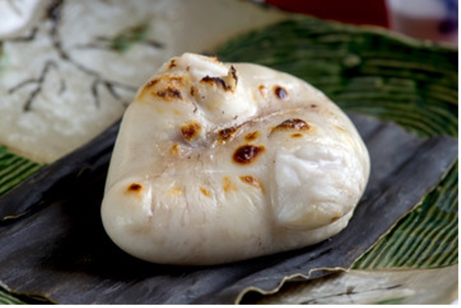
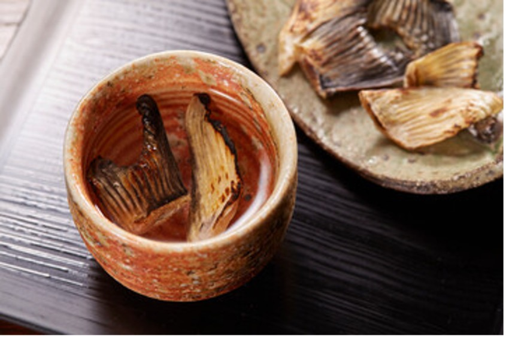

# ふぐ料理まとめ
 

ふぐ料理は、日本の食文化の中でも特に繊細で洗練された一品として知られている。ふぐはその淡白で上品な味わいと独特の食感が特徴であり、古くから日本人に愛されてきた食材である。しかし、ふぐには猛毒であるテトロドトキシンが含まれており、適切に処理しなければ食すことができない。そのため、ふぐを扱うには特別な資格が必要とされ、免許を持つ専門の料理人によってのみ提供される。

## 1.	**ふぐ料理の歴史**
ふぐの歴史は古く、日本では縄文時代の遺跡からふぐの骨が発見されている。しかし、ふぐの毒による中毒事故も古来から問題視されており、特に豊臣秀吉の時代にはふぐ食が禁止されることもあった。その後、江戸時代を経て明治時代になると、山口県下関の初代総理大臣・伊藤博文がふぐを食したことをきっかけに、禁止が解かれたという逸話がある。現在では、下関がふぐ料理の本場として広く知られ、多くのふぐ専門店が軒を連ねている。

## 2.	**代表的なふぐ料理**
ふぐ料理にはさまざまな種類があり、それぞれ異なる調理法によってふぐの美味しさが最大限に引き出される。
* ふぐ刺し（てっさ）
 

ふぐの刺身は、薄くスライスして美しく盛り付けられるのが特徴である。透き通るような身が円形に並べられた「菊盛り」は、見た目にも美しい。ポン酢やもみじおろし、細ネギとともに食べることで、淡泊ながらも深みのある味わいを楽しめる。
* ふぐちり（てっちり）
 

ふぐの身を昆布だしで煮る鍋料理である。シンプルな味付けのため、ふぐ本来の旨味を堪能できるのが特徴。鍋の具材には豆腐、白菜、春菊、椎茸などが使われ、最後にはふぐの出汁がたっぷり染み込んだ雑炊が楽しまれる。
* ふぐの唐揚げ
 

ふぐの身を唐揚げにすると、外はカリッと、中はふんわりとした食感を楽しむことができる。下味をつけたふぐをカラッと揚げることで、ふぐの甘みが引き立ち、ビールや日本酒との相性も抜群である。
* ふぐの白子焼き
 

冬のふぐの旬には、白子（精巣）が特に珍重される。とろけるような濃厚な味わいが特徴で、焼いた白子は香ばしく、日本酒との相性が非常に良い。また、白子ポン酢や白子の天ぷらなど、さまざまな調理法で楽しまれる。

## 3.	**ふぐ料理と安全管理**
ふぐは猛毒であるテトロドトキシンを含む。テトロドトキシンは神経のナトリウムイオンチャネルを阻害し、筋肉の麻痺や呼吸困難を引き起こす。摂取後30分～数時間で症状が現れ、解毒剤が存在しないため、治療は対症療法が中心となる。ふぐは生まれつき毒を持つわけではなく、特定の細菌が産生する毒を餌を通じて体内に蓄積することで毒化する。

ふぐの調理には高度な技術が求められるため、日本では「ふぐ調理師免許」が必要とされている。ふぐの毒は主に肝臓や卵巣、皮、腸に含まれており、これらを誤って食べると命に関わる危険がある。そのため、免許を持つ料理人が正しい知識と技術をもってふぐを調理し、安全に提供している。
また、近年では、無毒の養殖ふぐも開発され、より安全にふぐを楽しめる環境が整いつつある。しかし、ふぐ特有の緊張感と伝統的な技術を尊重し、生きた文化としてふぐ料理が継承されることが重要である。

## 4.	**ふぐ料理と日本酒**
 

ふぐ料理と日本酒の組み合わせは、非常に相性が良いとされる。特に、ふぐひれを炙って熱燗に浸した「ひれ酒」は、ふぐ料理の代表的な楽しみ方のひとつである。香ばしいひれの風味が酒に溶け込み、ふぐ料理の旨味をより一層引き立てる。

## 5.	**まとめ**
ふぐ料理は、日本の食文化の粋を集めた特別な料理であり、慎重な調理と独特の味わいが魅力である。その歴史や伝統、調理技術の奥深さは、日本の食文化を理解する上でも重要な要素である。ふぐ料理を味わうことは、ただ美味しい食事を楽しむだけでなく、職人の技や安全管理の知識を体感する貴重な経験となるだろう。

