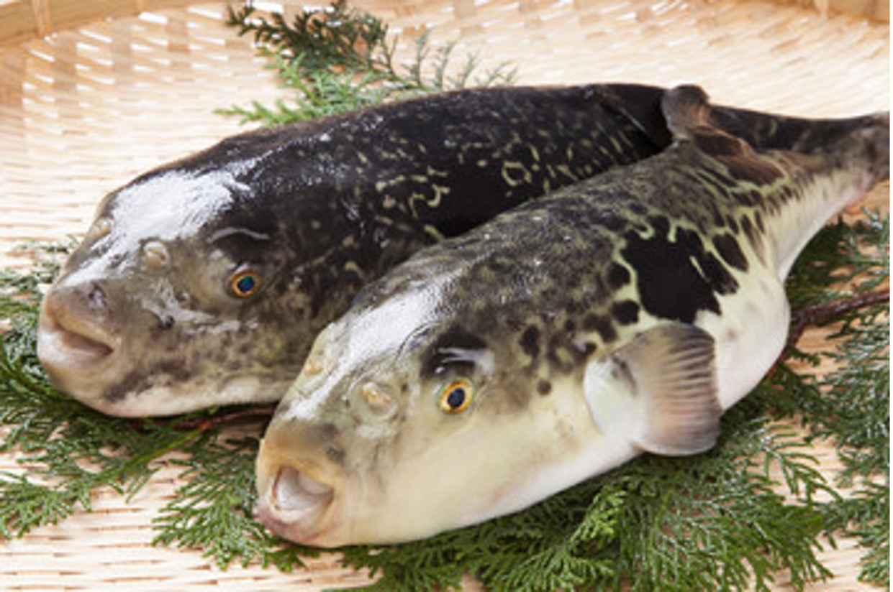

## ふぐに関連するタイ語学習資料  

### 1. ふぐの基本情報に関するタイ語  
ふぐ（河豚）は日本の代表的な高級魚の一つであり、毒を持つことで有名です。タイ語で「ふぐ」は以下のように表現されます。  

- **ふぐ（河豚）**：ปลาปักเป้า（プラー・パックパオ）  
- **魚**：ปลา（プラー）  
- **毒**：พิษ（ピット）  
- **猛毒**：พิษร้ายแรง（ピット ラーイレン）  
- **危険**：อันตราย（アンタラーイ）  

### 2. ふぐの種類に関するタイ語  
ふぐにはさまざまな種類があります。代表的なものをタイ語で覚えておきましょう。  

- **トラフグ（代表的な食用ふぐ）**：ปลาปักเป้าเสือ（プラー・パックパオ・スア）  
- **マフグ（温暖な海域に生息）**：ปลาปักเป้าหัวโต（プラー・パックパオ・フアトー）  
- **シマフグ（縞模様が特徴）**：ปลาปักเป้าลาย（プラー・パックパオ・ラーイ）  

### 3. ふぐ料理に関するタイ語  
ふぐは日本で特に高級な食材として珍重されています。ふぐ料理に関するタイ語を覚えましょう。  

- **ふぐ料理**：อาหารปลาปักเป้า（アーハーン・プラー・パックパオ）  
- **ふぐ刺し（てっさ）**：ซาซิมิปลาปักเป้า（サーシミ・プラー・パックパオ）  
- **ふぐちり（鍋料理）**：หม้อไฟปลาปักเป้า（モーファイ・プラー・パックパオ）  
- **ふぐの唐揚げ**：ปลาปักเป้าทอด（プラー・パックパオ・トート）  
- **ひれ酒（ふぐのひれを使った酒）**：สาเกครีบปลาปักเป้า（サーケー・クリープ・プラー・パックパオ）  

### 4. ふぐの毒に関するタイ語  
ふぐの毒（テトロドトキシン）は非常に危険で、適切な処理をしないと食べることができません。  

- **テトロドトキシン（ふぐ毒）**：สารพิษเตโตรโดทอกซิน（サーン・ピット・テートロドートクシン）  
- **毒抜き**：การกำจัดพิษ（ガーン・ガムジャット・ピット）  
- **食中毒**：อาหารเป็นพิษ（アーハーン・ペン・ピット）  
- **解毒剤**：ยาถอนพิษ（ヤー・トーン・ピット）  

### 5. ふぐに関するタイ語の会話例  
ふぐに関する会話を実際に使ってみましょう。  

**例1：レストランでふぐ料理を注文する**  
**A:** ขอเมนูปลาปักเป้าหน่อยครับ/ค่ะ（コー・メーヌー・プラー・パックパオ・ノーイ・クラップ/カー）  
（ふぐ料理のメニューをください。）  
**B:** มีซาซิมิปลาปักเป้า หม้อไฟ และปลาปักเป้าทอดครับ/ค่ะ  
（ミー・サーシミ・プラー・パックパオ、モーファイ、レ・プラー・パックパオ・トート・クラップ/カー）  
（ふぐの刺身、ふぐ鍋、ふぐの唐揚げがあります。）  
**A:** ขอซาซิมิปลาปักเป้าหนึ่งที่ครับ/ค่ะ  
（コー・サーシミ・プラー・パックパオ・ヌン・ティー・クラップ/カー）  
（ふぐ刺しを一人前お願いします。）  

**例2：ふぐの毒について話す**  
**A:** ปลาปักเป้ามีพิษใช่ไหมครับ/คะ？  
（プラー・パックパオ・ミー・ピット・チャイ・マイ・クラップ/カ？）  
（ふぐには毒があるんですよね？）  
**B:** ใช่ครับ/ค่ะ ต้องมีเชฟที่ได้รับอนุญาตในการทำอาหาร  
（チャイ・クラップ/カー。トーン・ミー・シェフ・ティー・ダイラップ・アヌヤート・ナイ・ガーン・タム・アーハーン）  
（はい、料理するには許可を受けたシェフが必要です。）  

### 6. ふぐに関するタイの文化との違い  
日本ではふぐ料理は高級であり、特別な資格を持つ料理人しか調理できません。一方、タイではふぐはあまり一般的な食材ではなく、毒が危険であるため食べる文化はほとんどありません。タイでは「危険な魚」として認識されており、食用にはされないことが多いです。  

### 7. まとめ  
この資料では、ふぐに関する基本的なタイ語を学びました。以下のポイントを押さえておきましょう。  
✅ ふぐはタイ語で「ปลาปักเป้า（プラー・パックパオ）」と呼ばれる  
✅ ふぐ料理の名前や注文の仕方を覚える  
✅ ふぐの毒に関する単語やフレーズを理解する  
✅ 日本とタイのふぐに関する文化の違いを知る  

ふぐに関するタイ語を覚えて、旅行や会話の際に活用してみてください！